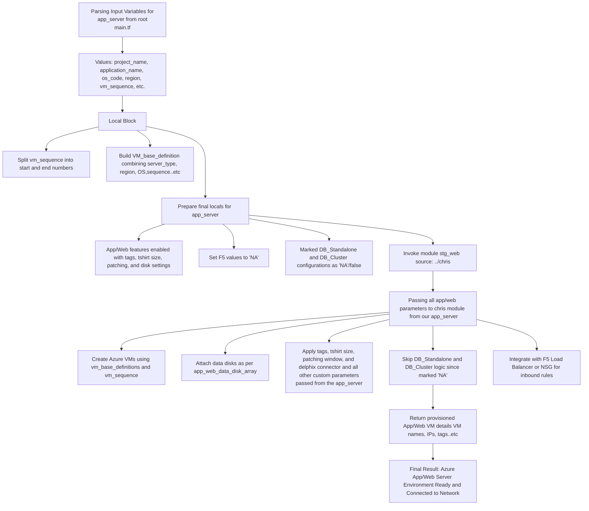

```mermaid
flowchart TD

%% === STAGE 1: INPUT VARIABLES ===
A1[Parsing Input Variables for<br> app_server from root main.tf]
A1 --> A2[Values: project_name, application_name, os_code, region, vm_sequence, etc.]
A2 --> A3[Local Block]

%% === STAGE 2: LOCAL CALCULATIONS ===
A3 --> B1[Split vm_sequence into start and end numbers]
A3 --> B2[Build VM_base_definition combining server_type, region, OS,sequence..etc]
A3 ---> C1[Prepare final locals for app_server]

%% === STAGE 3: CONFIGURATION PREPARATION ===
C1 --> D1[App/Web features enabled with tags, tshirt size, patching, and disk settings]
C1 --> D2[Set F5 values to 'NA']
C1 --> D3[Marked DB_Standalone and DB_Cluster configurations as 'NA'/false]

%% === STAGE 4: CALL CHRIS MODULE ===
C1 --> E1[Invoke module stg_web  source: ../chris  ]
E1 --> E2[Passing all app/web parameters to chris module <br> from our app_server]

%% === STAGE 5: INSIDE CHRIS MODULE ===
E2 --> F1[Create Azure VMs using vm_base_definitions and vm_sequence]
E2 --> F2[Attach data disks as per app_web_data_disk_array]
E2 --> F3[Apply tags, tshirt size, patching window, and delphix connector and all <br> other custom parameters passed from the app_server]
E2 --> F4[Skip DB_Standalone and DB_Cluster logic since marked 'NA']
E2 --> F5[Integrate with F5 Load Balancer or NSG for inbound rules]

%% === STAGE 6: OUTPUTS ===

F4 --> G1[Return provisioned App/Web VM details VM names, IPs, tags..etc]
G1 --> H1[Final Result: Azure App/Web Server Environment Ready and Connected to Network]
```
F4 --> G1[Return provisioned App/Web VM details VM names, IPs, tags..etc]
G1 --> H1[Final Result: Azure App/Web Server Environment Ready and Connected to Network]
